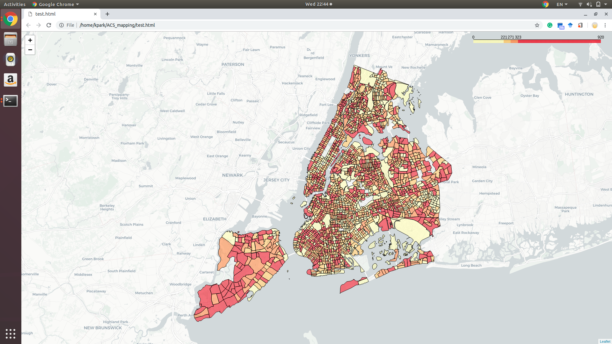

# ACS NYC mapper
- This is the simple code to plot interactive choropleth map using American Community Survey(census).
- The variable code can be found at [acs2017](https://api.census.gov/data/2017/acs/acs5/variables.html).
- You can restore data as ESRI shapefile into you current folder.

## Requirement
- pandas
- geopandas
- jenkspy
- folium

### These are might be followed by above packages or anaconda
- numpy
- shapely

```
# Requirements
conda install -c anaconda geopandas -y
conda install -c conda-forge jenkspy folium -y
```
## Example
If the requirements is installed, run the following code. \

```
# B01001_001E is Total population. You can find variable name in https://api.census.gov/data/2017/acs/acs5/variables.html and change variable.
# SHP file is stored in same folder.

# Mapping
python acs_mapper_choropleth.py B01001_001E

# Downloading
python acs2017_download.py B01001_001E #Total popluation shp saving
```
Showing B01001_001E variable by Quantile schema. <br>



## Reference
- [folium](https://github.com/python-visualization/folium)
- [Census API](https://www.census.gov/data/developers/data-sets.html)

* This code is only for NYC. You can change the region and spatial unit in the acs2017_download.py
* In the file, you need to change url looking like https://api.census.gov/data/2017/acs/acs5?get={},NAME&for=tract:*&in=state:36%20county:*
* state 36 is meaning New York State and I merged with NYC census tract data.
* If you have any questions, feel free to ask! Thanks!